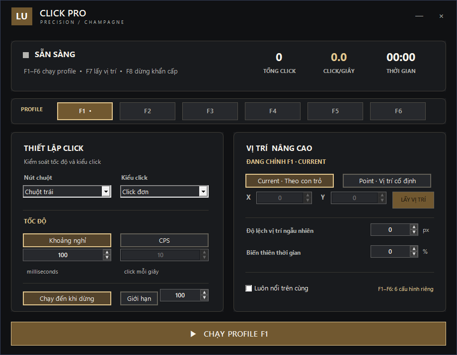

# LU Click Pro · Champagne Edition

Auto clicker Windows với nền than, điểm nhấn vàng champagne và 6 profile độc lập.

## Chạy ứng dụng

Tải `dist/LU-Click-Pro-Windows-x64.zip`, giải nén rồi mở `LU-Click-Pro.exe`.
Yêu cầu Windows 10/11 64-bit và .NET Framework 4.x. Không cần cài SDK để chạy.

| Phím | Chức năng |
| --- | --- |
| F1–F6 | Chạy/dừng profile tương ứng |
| F7 | Lấy tọa độ con trỏ cho profile đang chọn |
| F8 | Dừng |

Chọn ô profile để chỉnh thiết lập. Current click theo con trỏ; Point click tại tọa độ cố định.
Chỉ một profile chạy tại một thời điểm. Khi nhấn phím của profile khác, ứng dụng chuyển sang profile đó.

Cấu hình lưu khi thoát tại `%APPDATA%\LuClickPro\settings.ini`. File cấu hình cá nhân không nằm trong repo.
Tốc độ thực tế phụ thuộc Windows và ứng dụng nhận click. EXE chưa ký số.

## Build

Chạy `powershell -ExecutionPolicy Bypass -File .\source\build.ps1` trên Windows 64-bit có compiler .NET Framework.
Kết quả là `LU-Click-Pro.exe` ở thư mục gốc.

## Bản 1.3

- Giao diện Champagne: nền than, viền vàng, thẻ bo góc và trạng thái chọn tương phản.
- Thanh đóng/thu nhỏ luôn tách khỏi vùng nội dung cuộn.
- Sáu profile; click trái/phải/giữa, đơn/đúp, khoảng nghỉ hoặc CPS, giới hạn click và tùy chỉnh vị trí.

Đã kiểm tra build và render cửa sổ 920×715, 680×500 trên máy phát triển. Chưa kiểm tra trên mọi mức DPI hoặc mọi ứng dụng đích.
